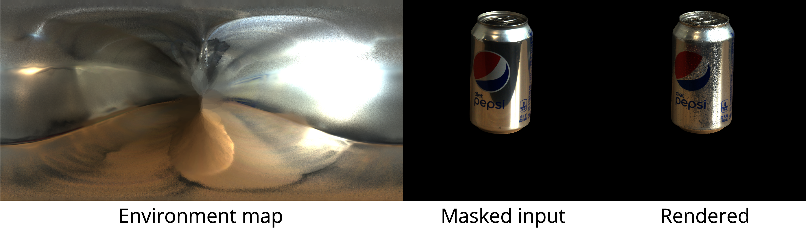

# [CVPR23] Accidental Light Probes
by [Hong-Xing Yu](https://kovenyu.com), [Samir Agarwala](https://samiragarwala.github.io/), [Charles Herrmann](https://scholar.google.com/citations?user=LQvi5XAAAAAJ&hl=en),
[Richard Szeliski](https://szeliski.org/RichardSzeliski.htm), [Noah Snavely](https://www.cs.cornell.edu/~snavely/), 
[Jiajun Wu](https://jiajunwu.com/), and [Deqing Sun](https://deqings.github.io/) from Stanford University and Google Research.

arXiv link: [https://arxiv.org/abs/2301.05211](https://arxiv.org/abs/2301.05211) 

Project website: [https://kovenyu.com/ALP](https://kovenyu.com/ALP)

This repository contains lighting estimation code for our CVPR23 [paper](https://arxiv.org/abs/2301.05211), Accidental Light Probes (ALP).
Our method cosists of two stages, offline ALP reconstruction 
where we provide our [reconstructed ALP dataset](https://drive.google.com/drive/folders/1yPWJMU_b4iAawTGgcWASb8ODWDV7ppb8?usp=sharing),
and single-image lighting estimation in this repository.

## Data 
We provide one example of reconstructed ALP model in `data/alp_models`, and others can be found [here](https://drive.google.com/drive/folders/1yPWJMU_b4iAawTGgcWASb8ODWDV7ppb8?usp=sharing). 
To evaluate single-image lighting estimation with ALPs, 
we collect an HDR image dataset with groundtruth environment maps and object masks.
We provide one example of the dataset in `data/eval`, and others can be found [here]().

## Environment
Our joint lighting-pose estimation uses the codebase from [NvDiffRecMC](https://github.com/NVlabs/nvdiffrecmc) repository.
We follow their environment setup:
```bash
conda create -n alp python=3.9
codna activate alp
conda install pytorch==1.12.1 torchvision==0.13.1 torchaudio==0.12.1 cudatoolkit=11.6 -c pytorch -c conda-forge
pip install ninja imageio PyOpenGL glfw xatlas gdown scipy lpips opencv-python
pip install git+https://github.com/NVlabs/nvdiffrast/
pip install --global-option="--no-networks" git+https://github.com/NVlabs/tiny-cuda-nn#subdirectory=bindings/torch
```
In addition, we use the [skylib](https://github.com/soravux/skylibs) packages:
```bash
pip install --upgrade skylibs
conda install -c conda-forge openexr-python openexr
```


## Usage
A demo can be found by (please replace paths there with your actual paths):
```bash
bash scripts/eval_pdiet.sh
```
where we estimate lighting from a diet Pepsi example on an indoor scene.
If running correctly, you should see an output similar to the below image in `eval_results`:


## Citation
If you find our repository useful, please consider
citing our paper.
```
@inproceedings{yu2023alp,
    author={Yu, Hong-Xing and Agarwala, Samir and Herrmann, Charles and Szeliski, Richard and Snavely, Noah and Wu, Jiajun and Sun, Deqing},
    title = {Accidental Light Probes},
    booktitle = {Proceedings of the IEEE International Conference on Computer Vision and Pattern Recognition},
    year = {2023}
}
```